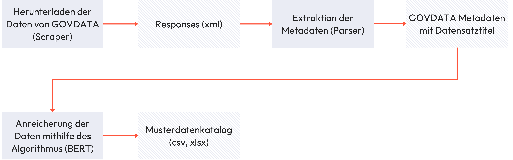
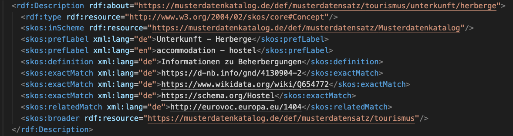

# Musterdatenkatalog

Der Musterdatenkatalog schafft einen Überblick über die offenen Daten die Kommunen in Deutschland der Allgemeinheit zur Verfügung stellen. Dabei werden mit Hilfe einer zweistufigen Taxonomie die Daten thematisch eingeordnet.

## Installation und Ausführung



Die Pipeline besteht aus drei Komponenten:

- Download der Daten von GovData (generiert die Responses)
- Extraktion der relevanten Daten aus den Responses (extrahiert die GovData Metadaten mit Datensatztitel)
- Anreicherung der Daten mithilfe des Machine Learning Modells (erstellt den Musterdatenkatalog)

Mit der Ausführung der Pipeline wird der Musterdatenkatalog erstellt:

```bash
poetry install
poetry shell
python src/components/pipeline.py
```

Der Musterdatenkatalog und die Response Dateien finden sich nach dem Durchlauf der Pipeline in dem Ordner `extraction`. Zudem wird in dem Ordner `docs` eine Datei `logger_pipeline.log`die die einzelnen Schritt der Pipeline dokumentiert.

Die Pipeline kann zudem angepasst werden um die Anzahl an Dokumenten, die von GovData heruntergeladen werden zu variieren. Die Funktion 'get_current_dataset_list' die in dem scraper.py Skript benutzt wird hat für sample_size den standardmäßigen Wert '-1'. Dieser gibt an, dass alle Dokumente von GovData heruntergeladen werden sollen. Wird sample_size beispielsweise auf den Wert '5' gesetzt wird ein random sample von der Größe 5 von allen Daten auf GovData gezogen.

## Machine Learning Algorithmus

### Semantic Search

Der bundesweite Musterdatenkatalog wird automatisiert mithilfe eines Algorithmus erstellt. Der Algorithmus besteht aus zwei Komponenten. Das Embedding basiert auf einem vortrainierten Bidirectional Encode Representations from Transformers (BERT) Modell (bert-base-german-cased), welcher mithilfe von annotierten Daten und einer Siamese Network Architektur trainiert wurde. Die [Daten](https://huggingface.co/and-effect/musterdatenkatalog_clf) wurden mithilfe eines Samples von GovData erstellt und mithilfe eines Cross-Encoders angereichert. Die vektorisierten Titel werden dann mithilfe von Semantic Search klassifiziert. Weitere Erklärungen finden sich in der [Model Card](https://huggingface.co/and-effect/musterdatenkatalog_clf). Eine Demo des Algorithmus ist [hier](https://huggingface.co/spaces/and-effect/Musterdatenkatalog) bereitgestellt.

### Training

Der Algorithmus wurde mithilfe einer [Siamese Network Architektur](https://www.sbert.net/docs/usage/semantic_textual_similarity.html) trainiert und mithilfe von [SBERT Augmentation](https://www.sbert.net/examples/training/data_augmentation/README.html) optimiert. Mithilfe des Trainingsdatensatzes wurde zunächst ein bi-encoder BERT Modell basierend auf bert-base-german-cased trainiert (siehe skript `src/components/model_training/sentece_transformer_trainer.py` und `src/components/model_training/train_revision_a90730`). Dafür wurden Paare von ähnlichen und nicht ähnlichen Sätzen aus dem Trainingsdatensatz gebildet. Sätze, die ähnlich zu einander sind, wurden mit einem Score von 0.8 gelabelt. Sätze, die nicht ähnlich zueinander sind, mit einem Score von 0.2. Trotz hoher Performance zeigten manuelle Evaluationen, dass der Algorithmus in den Vorhersagen nicht ausreichend stabil ist. D.h. kleine Veränderungen im Input haben zu einer Veränderungen der Vorhersagen geführt. Um dem entgegenzuwirken wurde mithilfe von SBERT Augmentation die Datenmenge erweitert und der Algorithmus erneut trainiert. Dabei wurde wie folgt vorgegangen:

Zunächst wurde mit den Daten aus dem ursprünglichen Training (Gold Sample) ein Cross-Encoder trainiert, der Similarity Scores für ein Paar von Sätzen vergeben kann. Mithilfe des bereits trainierten bi-encoders wurden dann aus den Trainingsdaten Paare gebildet, die ein hohes Scoring haben. Diesen Sätzen (Silver Sample) wurde dann mithilfe des trainierten Cross-Encoder Modells ein Scoring zugeteilt. Im ursprünglichen SBERT Augmentation Ansatz werden dann die Gold Sample und die Silver Sample Daten verwendet um ein Modell zu trainieren. Da allerdings schon ein Bi-Encoder auf den Gold Sample trainiert vorliegt, wurde dieser bi-encoder als base modell verwendet und mithilfe der Silver Daten nochmals gefinetuned, um einen stabileren bi-encoder zu entwicklen (siehe Skript `src/components/model_training/sbert_augmentation_trainer.py` und `src/components/model_training/train.py`). Der Bi-Encoder kann [hier](https://huggingface.co/and-effect/musterdatenkatalog_clf) heruntergeladen werden. Der ursprüngliche bi-encoder ist bei unter Angabe der Revision a907303609264155e704988a4e52dd07f169538f dort ebenfalls abrufbar.

## Taxonomie in RDF-Format

Die Taxonomie, welche für die Klassifikation der Datensätze benutzt wird, hat zwei Ebenen: Thema und Bezeichnung. Auf der Ebene 'Thema' wird zwischen 25 Konzepten unterschiedene, wie zum Beispiel 'Wirtschaft' oder 'Freizeit'. Die Ebene 'Bezeichnung' hat 241 verschiedene Konzepte und gliedert die Daten noch genauer ein, wie zum Beispiel für das Thema 'Freizeit' in sieben Bezeichnungen mit Namen wie 'Bad und Freibad' oder 'Grillplatz'. Die Kombination aus Thema und Bezeichnung ergibt den Musterdatensatz.

Die Taxonomie wird im RDF-Format generiert. Dazu kann die Datei 'rdf_formatter.py' benutzt werden. Dabei wird der SKOS-Standard benutzt um die Taxonomie abzubilden. Jedes Konzept hat dabei eine eindeutige URI (Siehe Liste aller Musterdatensätze [hier](https://bertelsmannstift.github.io/Musterdatenkatalog/def/musterdatensatz.html)). Zusätzlich zu den bestehenden Konzepten wurde die Taxonomie mit Matches zu anderen Begriffen angereichert. Bei einem Konzept wurden dann verwandte Begriffe oder ähnliche Konzepte die bei DND, OGD, Schema.org, EuroVoc oder Wikidata zu finden sind hinzugefügt. Durch den SKOS-Standard kann so auch der Match-Typ angegeben werden.

Der nachfolgende Ausschnitt aus der generierten RDF-Datei gibt einen Einblick in den SKOS-Standard für das Beispiel 'Tourismus - Unterkunft - Herberge'.



## Bereitstellung des Musterdatenkatalogs

Die von der Pipeline generierten Daten wurden vor der Veröffentlichung aufbereitet. In dem Ordner 'src/preprocessing/extraction' findet sich ein Skript für jedes Element: das Potential der Kommunen, der ausführliche Musterdatenkatalog und die Tabellenansicht des Musterdatenkatalogs. Die Ergebnisse sind auf der [Website der Bertelsmann Stiftung](https://www.bertelsmann-stiftung.de/de/unsere-projekte/smart-country/musterdatenkatalog) zu sehen.

## Projekt Beschreibung

### Hintergrund des Musterdatenkatalogs

Wer bis jetzt die offenen Daten über eine einzelne Kommune hinaus nutzen wollte, musste viel Zeit aufwenden, um sich einen Überblick zu verschaffen. Ebenso bekommen Kommunen bisher nur schwer eine Übersicht darüber, welche Daten sich zur Veröffentlichung als Open Data eignen. Das Ziel des Musterdatenkatalogs ist es, eine gute Übersicht über Open Data in Kommunen zu verschaffen. Der Musterdatenkatalog wurde im Rahmen des Projekts Smart Country der Bertelsmann Stiftung gemeinsam mit GovData, dem KDZ – Zentrum für Verwaltungsforschung (Wien) und der Open Knowledge Foundation Deutschland sowie Kommunen entwickelt.

Eine erste 2019 veröffentliche Version des Musterdatenkatalogs umfasst die offenen Daten von Open-Data-Vorreiterkommunen in Nordrhein-Westfalen und diente als Prototyp. Die zweite im April 2020 veröffentlichte Version des Musterdatenkatalogs umfasste bereits alle Kommunen in Nordrhein-Westfalen, deren offene Daten über das Open.NRW-Portal auffindbar sind. Die dritte veröffentlichte Version des Musterdatenkatalogs (veröffentlicht Anfang März 2021) umfasste alle offenen Daten von Kommunen und kommunalen Dienstleistern, die über das bundesweite Open-Data-Portal GovData auffindbar sind. Diese Version schaffte somit erstmals bundesweit einen Überblick über die offenen Daten, die Kommunen der Allgemeinheit zur Verfügung stellen.

Nun gibt es die Version 4.0 des Musterdatenkatalogs. Über 100 Kommunen sind neu hinzugekommen. Durch eine neue Taxonomie sind enthaltene Datensätze besser auffindbar und der Algorithmus, der Datensätze den neuen Themen zuordnet, klassifiziert diese noch genauer. Außerdem haben alle Musterdatensätze eine Beschreibung und eine englische Übersetzung erhalten.

### Kernfunktion des Musterdatenkatalogs

Bisher stellen rund 150 Kommunen in Deutschland, darunter viele Großstädte von Kiel bis München, aber auch einige Klein- und Mittelstädte, offene kommunale Daten zur Verfügung. Der Musterdatenkatalog ordnet die Datensätze rund 25 verschiedenen kommunalen Themenbereichen zu. Interessenten können sich dank des Katalogs zum Beispiel alle offenen Daten einer Kommune oder die offenen Daten unterschiedlicher Kommunen zu einem bestimmten Thema anzeigen lassen. Dies erhöht die Vergleichbarkeit der Daten und kann gleichzeitig Anreize für Kommunen schaffen, weitere offene Daten bereitzustellen. Der bundesweite Musterdatenkatalog wurde mit einem Machine-Learning-Algorithmus automatisiert erstellt.

## Fragen & Antworten

<details>
<summary>Was ist ein Musterdatensatz?</summary>
<br>
Bei der Vergleichbarkeit von Datensätzen der Kommunen gibt es zwei Herausforderungen. Einerseits gibt es sehr unterschiedliche Bezeichnungen für Datensätze, die eigentlich ähnlich sind. Zur Veranschaulichung hier ein Beispiel öffentlicher Toiletten:

Bonn: „Stadt Bonn: Standorte öffentlicher Toiletten“
Köln: „Stadt Köln: Oeffentliche Toiletten Koeln“
Düsseldorf: „Standorte öffentlicher Toiletten Düsseldorf“
Moers: „Stadt Moers: Öffentliche Toiletten in Moers mit Hinweisen für Menschen mit Behinderung“

Die individuellen Bezeichnungen erzeugen nicht nur das Problem, dass gleiche Datensätze unterschiedlich bezeichnet werden, sondern es kann andererseits mitunter vorkommen, dass die Bedeutung der Datensätze über die Bezeichnung nicht immer leicht verständlich ist.

Der Musterdatenkatalog soll bisherige Ordnungskriterien nicht ersetzen oder einheitliche Datensatzbezeichnungen in der Verwaltung vorschreiben. Vielmehr soll ein „Musterdatensatz“ ein zusätzliches Ordnungskriterium einführen, das die Vergleichbarkeit zwischen den Kommunen verbessert. Zur Veranschaulichung dient erneut das Beispiel „öffentliche Toiletten“. Der Musterdatensatz lautet: „Gesundheit– Öffentliche Toilette“.

</details>
<br>

<details>
<summary>Warum werden mir in manchen Musterdatensätzen auch Datensätze angezeigt, die eigentlich nicht dort hineingehören?</summary>
<br>
Warum werden mir in manchen Musterdatensätzen auch Datensätze angezeigt, die eigentlich nicht dort hineingehören?

Der bundesweite Musterdatenkatalog wird automatisiert mit einem Algorithmus erstellt. Dieser ordnet die offenen Daten in die Musterdatensätze ein. Wir haben den Algorithmus umfangreich trainiert, aber eine hundertprozentige Zuordnung aller Datensätze kann so nicht gelingen.

Bei sehr vielen Datensätzen sind die Metadaten nur unzureichend beschrieben. Es gibt teilweise unklare Titel oder fehlende Beschreibungen. Ein Beispiel eines Bebauungsplans aus Rheinland-Pfalz: Titel: „E1“; Beschreibung: „Mörlheim, An den Herrenäckern“.

In manchen Musterdatensätzen gibt es nur wenige Datensätze. Auf dieser dünnen Datenbasis fällt es dem Algorithmus schwer, zu lernen.

Der Vorgänger des bundesweiten Musterdatenkatalogs, der NRW-Katalog, wurde mit seinen rund 2.500 Datensätzen manuell zugeordnet. Und selbst bei einer manuellen Zuordnung gibt es gelegentlich Fehler. Auch ein Algorithmus funktioniert nicht perfekt.

Mit einer breiteren Datenbasis wird der Algorithmus sich kontinuierlich verbessern. Außerdem hoffen wir, dass der Musterdatenkatalog auch einen Impuls setzen kann, damit Kommunen ihre Metadaten besser und eindeutiger beschreiben.

</details>
<br>

<details>
<summary>Wird der Musterdatenkatalog automatisch aktualisiert, sobald eine Kommune offene Daten veröffentlicht?</summary>
<br>
Nein. Der Musterdatenkatalog kann nicht automatisch bei jeder neuen Veröffentlichung offener Datensätze aktualisiert werden. Das hat vor allem zwei Gründe:

1.  Es gibt technisch bisher keine Lösung mit geringem Aufwand, um automatisiert abzugleichen, welche neuen Datensätze auf GovData.de für eine Aufnahme in den Musterdatenkatalog in Frage kommen.

2.  Die Aufbereitung der heruntergeladenen Daten erzeugt Arbeitsaufwand, weil aus den beschriebenen Metadaten häufig gar nicht klar hervorgeht, welche Kommune einen Datensatz zur Verfügung gestellt hat.

Eine Aktualisierung wird von der Bertelsmann Stiftung in Auftrag gegeben und zweimal pro Jahr durchgeführt.

</details>
<br>

<details>
<summary>Warum fehlen im Musterdatenkatalog manche Kommunen, die bereits offene Daten veröffentlichen?</summary>
<br>

Im Musterdatenkatalog führen wir offene Daten zusammen, die im Portal GovData.de abrufbar sind. Dort sind keine kommunalen Daten aus den Bundesländern Bayern, Niedersachsen, Sachsen-Anhalt und Saarland abrufbar. Ein Abruf der Daten aus Open-Data-Landesportalen (die die meisten der genannten vier Bundesländer nicht haben) oder aus kommunalen Portalen wäre zu aufwändig. Sollten künftig die Daten aus Kommunen der vier genannten Bundesländer auf GovData verfügbar sein, werden diese auch in den Musterdatenkatalog mit aufgenommen.

</details>
<br>
<details>
<summary>In meiner Kommune wurden bereits Datensätze veröffentlicht, die im Musterdatenkatalog nicht auftauchen. Warum?</summary>
<br>
Im Musterdatenkatalog Version 4 wurden offene Daten berücksichtigt, die bis zum Stichtag 20. April 2023 über GovData.de auffindbar waren. Daten, die nach diesem Stichtag veröffentlicht wurden, können erst nach einer weiteren Aktualisierung Eingang in den Musterdatenkatalog finden.
</details>
<br>
<details>
<summary>Zeigt der Musterdatenkatalog alle Daten an, die in einer Kommunen verfügbar sein sollten?</summary>
<br>
Nein. Der Musterdatenkatalog wurde 2019 zunächst auf Basis eines Pilotprojekts mit 1000 Datensätzen aus fünf Kommunen in Nordrhein-Westfalen entwickelt (Musterdatenkatalog 1.0). Es konnten also „nur“ Musterdatensätze auf Basis von 1000 Datensätzen gebildet werden. Es wurden im Laufe der Zeit bei Bedarf neue Musterdatensätze entwickelt. Dazu hat sich ein kleiner Arbeitskreis mit kommunalen Vertreter:innen gebildet. Auf GitHub https://github.com/bertelsmannstift/Musterdatenkatalog gibt es außerdem die Möglichkeit, neue Musterdatensätze vorzuschlagen.

Im Mai 2023 wurde die Version 4 des Musterdatenkatalogs mit einer völlig neuen Taxonomie veröffentlicht. Sie bietet eine bessere Übersicht und erleichtert dem Algorithmus eine genauere Klassifizierung der Datensätze.

Da der Musterdatenkatalog stets auf der Konsolidierung der bisher bereits veröffentlichten Daten basiert, enthält er gute Hinweise darauf, welche Art von Daten in einer Kommune typischerweise verfügbar sein müssten. Es kann aber natürlich darüber hinaus noch jede Menge weiterer Daten geben, die bisher keine der Kommunen in Deutschland veröffentlicht hat und die daher noch nicht im Musterdatenkatalog enthalten sein können.

</details>
<br>
<details>
<summary>Wer hat an der Erstellung des Musterdatenkatalogs mitgewirkt?</summary>
<br>
Der Musterdatenkatalog wurde zunächst als Prototyp im Mai 2019 veröffentlicht. Der Erstellung des Prototypen gingen drei Workshops in Köln voraus, zu denen GovData und die Bertelsmann Stiftung mehr als 20 Expert*innen aus der Open-Data-Community eingeladen haben. Die Ergebnisse der Workshops wurden in enger Abstimmung mit Vertreter*innen der Städte Bonn, Düsseldorf, Köln und Moers sowie mit dem IT-Dienstleister kdvz Rhein-Erft-Rur vertieft und mündeten in dem im Mai 2019 veröffentlichten Prototypen. Dieser bildete die Grundlage für die anschließende Entwicklung eines NRW-Musterdatenkatalogs durch die Projektpartner Bertelsmann Stiftung, GovData, KDZ – Zentrum für Verwaltungsforschung und Open Knowledge Foundation Deutschland gemeinsam mit Open.NRW. Der bundesweite Musterdatenkatalog ist eine Weiterentwicklung des Prototoypen und der NRW-Version. Die technische Umsetzung des Musterdatenkatalogs erfolgte durch Mila Frerichs (Civic Vision). Für die vierte Version des Musterdatenkatalogs wurde die Taxonomie im Rahmen eines Workshops nochmals überarbeitet und mit Hilfe von &effect umgesetzt. Darauf aufbauend hat das Team von &effect dann einen neuen Algorithmus für die Klassifikation der Musterdatensätze entwickelt.
</details>
<br>

## Weiterführende Links

- [Veröffentlichung Musterdatenkatalog 4.0](https://www.bertelsmann-stiftung.de/de/unsere-projekte/daten-fuer-die-gesellschaft/projektnachrichten/der-neue-musterdatenkatalog-mehr-kommunen-und-neue-struktur)

- [Der Musterdatenkatalog](https://www.bertelsmann-stiftung.de/de/unsere-projekte/smart-country/musterdatenkatalog)
- [Ein Leitfaden für offene Daten](https://www.bertelsmann-stiftung.de/de/publikationen/publikation/did/ein-leitfaden-fuer-offene-daten)
- [Open Data in Kommunen](https://www.bertelsmann-stiftung.de/de/publikationen/publikation/did/open-data-in-kommunen2019) – Eine Broschüre
- [Open Data in Kommunen](https://www.bertelsmann-stiftung.de/de/publikationen/publikation/did/open-data-in-kommunen-all) – Eine Kommunalbefragung zu Chancen und Herausforderungen der Bereitstellung offener Daten
- [Taxonomy](https://huggingface.co/datasets/and-effect/MDK_taxonomy)
- [Dataset](https://huggingface.co/and-effect/musterdatenkatalog_clf)
- [Machine Learning Algorithm](https://huggingface.co/and-effect/musterdatenkatalog_clf)
- [Demo](https://huggingface.co/spaces/and-effect/Musterdatenkatalog)

## Lizenz

Creative Commons Zero (CC0)
